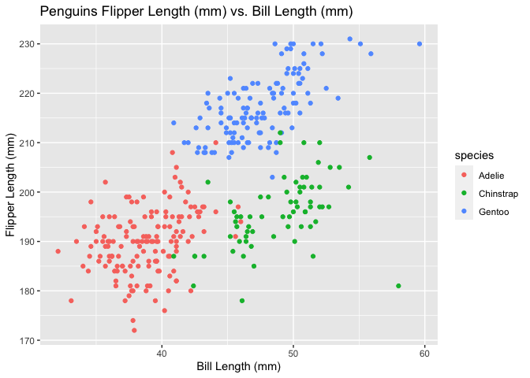

p8105\_hw1\_hx2306
================
HuijunXiao
9/21/2021

## Problem 1

-   Step 1: Create the dataframe

``` r
# a random sample of size 10 from a standard Normal distribution
nordist_sam <-
  rnorm(10)

# a logical vector indicating whether elements of the sample are greater than 0
sam_greater0 <-
  nordist_sam >0 

# a character vector of length 10
chara_10 <-
  c("a","b","c","d","e","f","g","h","i","j")

# a factor vector of length 10, with 3 different factor “levels”
fact_10 <-
  c("good","bad","ok","good","bad","ok","good","bad","ok","good")%>%
  as.factor()
```

``` r
# problem 1 data frame
df_problem1 <-
  tibble(nordist_sam,sam_greater0,chara_10,fact_10)

df_problem1
```

    ## # A tibble: 10 × 4
    ##    nordist_sam sam_greater0 chara_10 fact_10
    ##          <dbl> <lgl>        <chr>    <fct>  
    ##  1      -0.585 FALSE        a        good   
    ##  2      -0.792 FALSE        b        bad    
    ##  3       1.49  TRUE         c        ok     
    ##  4       0.245 TRUE         d        good   
    ##  5       3.17  TRUE         e        bad    
    ##  6       1.72  TRUE         f        ok     
    ##  7      -1.33  FALSE        g        good   
    ##  8       1.59  TRUE         h        bad    
    ##  9       1.69  TRUE         i        ok     
    ## 10      -1.15  FALSE        j        good

-   Step 2: Take the mean of each variable in the data frame

``` r
# Mean of nordist_sam
mean(pull(df_problem1,nordist_sam))
```

    ## [1] 0.6055418

``` r
# Mean of sam_greater0
mean(pull(df_problem1,sam_greater0))
```

    ## [1] 0.6

``` r
# Mean of chara_10
mean(pull(df_problem1,chara_10))
```

    ## Warning in mean.default(pull(df_problem1, chara_10)): argument is not numeric or
    ## logical: returning NA

    ## [1] NA

``` r
# Mean of fact_10
mean(pull(df_problem1,fact_10))
```

    ## Warning in mean.default(pull(df_problem1, fact_10)): argument is not numeric or
    ## logical: returning NA

    ## [1] NA

**Only numeric and logical variables are able to take the means.For
character and factor variables, taking the mean does not work and will
return NA instead.**

-   Step 3: Add `as.numeric` function to logical,character and factor
    variables

``` r
# add as.numeric to nordist_sam
as.numeric(pull(df_problem1,nordist_sam))

# add as.numeric to sam_greater0
as.numeric(pull(df_problem1,sam_greater0))

# add as.numeric to chara_10
as.numeric(pull(df_problem1,chara_10))
```

    ## Warning: NAs introduced by coercion

``` r
# add as.numeric to fact_10
as.numeric(pull(df_problem1,fact_10))
```

**`as.numeric` function can be applied to logical variables
successfully.**  
**However, it cannot be applied to character and factor variables.**  
**This helps explain what happens when I try to take the mean as factor
and character strings are not properly formatted numbers.**  
**Hence, they cannot be converted to the numeric class and means cannot
be calculated as well.**

## Problem 2

``` r
#Load Penguins dataset 
data("penguins", package = "palmerpenguins")
```

-   Step 1: Short description of the `penguins` dataset

``` r
# the data in this dataset, including names / values of important variables
head(penguins)
```

    ## # A tibble: 6 × 8
    ##   species island bill_length_mm bill_depth_mm flipper_length_… body_mass_g sex  
    ##   <fct>   <fct>           <dbl>         <dbl>            <int>       <int> <fct>
    ## 1 Adelie  Torge…           39.1          18.7              181        3750 male 
    ## 2 Adelie  Torge…           39.5          17.4              186        3800 fema…
    ## 3 Adelie  Torge…           40.3          18                195        3250 fema…
    ## 4 Adelie  Torge…           NA            NA                 NA          NA <NA> 
    ## 5 Adelie  Torge…           36.7          19.3              193        3450 fema…
    ## 6 Adelie  Torge…           39.3          20.6              190        3650 male 
    ## # … with 1 more variable: year <int>

**`penguins` dataset contains 8 variables, which are species, island,
bill length, bill depth, flipper length, body mass, sex and year, and
344 rows of observations.**

**`penguins` dataset included data recorded from 2007 to 2009.**

**For species of this dataset, there are 3 categories, which are Adelie,
Gentoo, Chinstrap.**

**For island of this dataset, there are 3 categories, which are
Torgersen, Biscoe, Dream.**

**The bill length (mm) starts from 32.1 to 59.6 with mean equals to
43.9219298.**

**The bill depth (mm) starts from 13.1 to 21.5 with mean equals to
17.1511696.**

**The flipper length (mm) starts from 172 to 231 with mean equals to
200.9152047.**

**The body mass (g) starts from 2700 to 6300 with mean equals to
4201.754386.**

-   Step 2: Make a scatterplot of flipper\_length\_mm (y) vs
    bill\_length\_mm (x)

``` r
## make plot
ggplot(penguins, aes(x = bill_length_mm, y = flipper_length_mm, color = species)) + 
  geom_point() +
  ggtitle("Penguins Flipper Length (mm) vs. Bill Length (mm)") +
  ylab("Flipper Length (mm)") +
  xlab("Bill Length (mm)")
```

    ## Warning: Removed 2 rows containing missing values (geom_point).

<!-- -->

``` r
## save plot
ggsave("p8105_hw1_hx2306_scatterplot.jpeg",plot = last_plot())
```

    ## Saving 7 x 5 in image

    ## Warning: Removed 2 rows containing missing values (geom_point).
